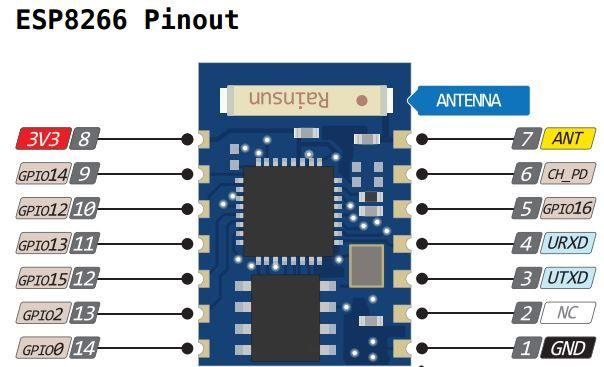
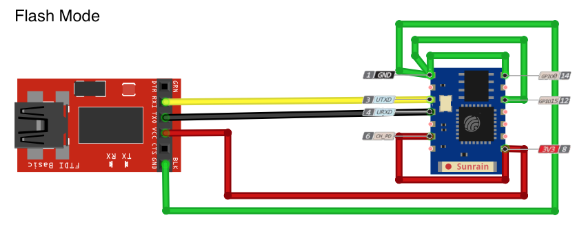
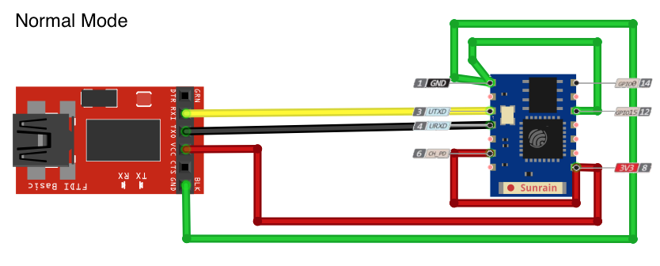

## Flash Mode 
To flash the ESP-03 connect the following:


| ESP PIN    | FTDI Flasher |
| ---------- | ------------ |
| VCC        | VCC          |
| GND        | GND          |
| RX         | TX           |
| TX         | RX           |
| CH_PD / EN | VCC          |
| GPIO 0     | GND          |
| GPIO 15    | GND          |

Before starting the Upload, disconnect the flasher from the ESP. Do not disconnect the USB-Cable! Disconnect the cables on the flasher!

For the flashing to work, the following settings have to be present in the file `platformio.ini`:

```ini
[env:esp03]
platform = espressif8266
board = d1
board_build.flash_mode = dout
board_build.ldscript = eagle.flash.512k64.ld
upload_resetmethod = ck
framework = arduino
monitor_speed = 115200
upload_speed = 115200
```

## Normal Mode

For normal operation of the ESP-03 connect the following:


| ESP PIN    | FTDI Flasher    |
| ---------- | --------------- |
| VCC        | VCC             |
| GND        | GND             |
| RX         | TX              |
| TX         | RX              |
| CH_PD / EN | VCC             |
| GPIO 0     | floating or VCC |
| GPIO 15    | GND             |